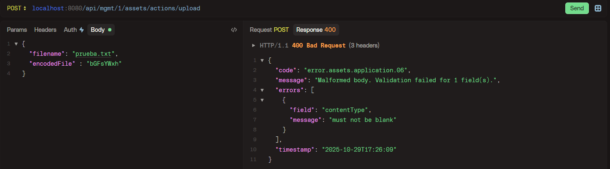
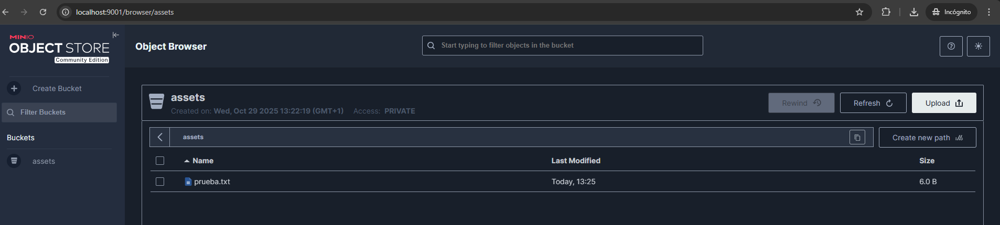
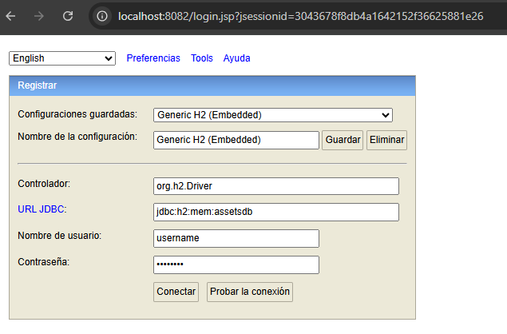
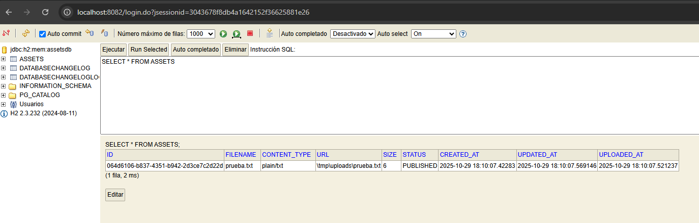

# Asset Service

Este proyecto es una pequeña POC que implementa una solución para hacer subidas de ficheros con sus metadatos y realizar búsquedas sobre estos para recuperarlos.

## Estructura principal

Teniendo en cuenta que el aplicativo pudiera escalar en complejidad en el futuro, se ha optado por un enfoque que emplea arquitectura hexagonal + DDD + Clean Code. El esquema básico es el siguiente:

* __application__
    * Lógica de negocio de la aplicación. Orquesta las llamadas a los métodos de los puertos de salida para subir ficheros a un componente externo, actualizar su estado en la BD y realizar búsquedas sobre ellos.
* __domain__
    * Clases comunes e interfaces para comunicarse entre las capas del aplicativo.
* __infrastructure__
    * Implementación los puertos de salida del aplicativo, además de los adaptadores con los mappers entre dominio-entidad.
    * En este caso, se implementan:
      * Puertos de salida para llamar a la BD  (en este caso, un H2 en memoria, por la simplicidad del enunciado).
      * Puertos de salida para llamar a los componentes externos que guardan los ficheros. Para reflejar el correcto funcionamiento de dos implementaciones distintas de forma sencilla, se ha realizado:
        * Un almacenamiento local en la máquina en la que se esté ejecutando el microservicio (para ejecutarlo en local de forma sencilla).
        * Un almacenamiento usando MinIO para simular llamadas a un aplicativo externo de terceros (para cuando se despliega el aplicativo usando docker compose).
####        * NOTA: Estas implementaciones en un entorno real deberían estar cada una en su módulo de infraestructura correspondiente.
* __interfaces__
    * Implementación de puertos de entrada al aplicativo (en este caso una API REST), además de los adaptadores con los mappers entre dominio-DTO.

Aunque en arquitectura hexagonal las implementaciones de los puertos tambien pueden estar dentro de un único paquete de infraestructura, por cuestiones de claridad prefiero separar puertos de entrada y de salida en paquetes distintos, que es otro enfoque válido en estas soluciones.

### Excepciones
El aplicativo implementa un modelo de respuesta de errores estandarizado para todo el proyecto, que hace uso de un RestControllerAdvice para manejarlos. Todas las excepciones incorporan un código propio de excepción del aplicativo, un mensaje de error descriptivo, un identificador único por petición y un TimeStamp con la fecha en la que se produjeron, además de devolver el código HTTP adecuado para cada tipo.



## Testing
El proyecto tiene tests unitarios y de integración. Con el plugin de Jacoco se asegura que, al compilar el proyecto, el límite mínimo de line coverage y de branch coverage sea del 85%. La creación de la base de datos se ha implementado mediante scripts de Liquibase.

## Dependencias

| library                             | version |
|-------------------------------------|---------|
| Java SDK                            | 17+     |
| Spring Boot                         | 3.5.7   |
| Maven                               | 3.10.x+ |

## Instalación y ejecución

#### Para compilar y ejecutar los tests:

```bash
  mvn clean install
```

#### Para ejecutar el microservicio desde local (desde la raíz del proyecto):

```bash
  java -jar target\asset-service-1.0.0-SNAPSHOT.jar --spring.profiles.active=local
```
Esto despliega el proyecto en local con una base de datos H2 en memoria y hace uso de la carpeta /tmp/uploads para guardar los ficheros.

#### Para ejecutar el microservicio con Docker Compose (requiere tener Docker instalado). Desde la raíz del proyecto:

```bash
  docker-compose up -d
```
Esto despliega el microservicio con el profile "minio", el H2, el servicio de MinIO accesible a través del navegador en el localhost:9001 (minioadmin:minioadmin), y un servicio de MinIO para crear el bucket al arrancar.



La consola del H2 para ambos perfiles se despliega en http://localhost:8082/ (username:password)




